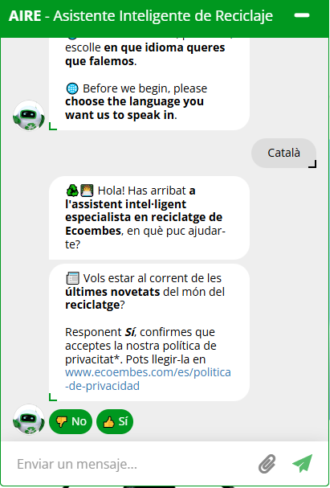
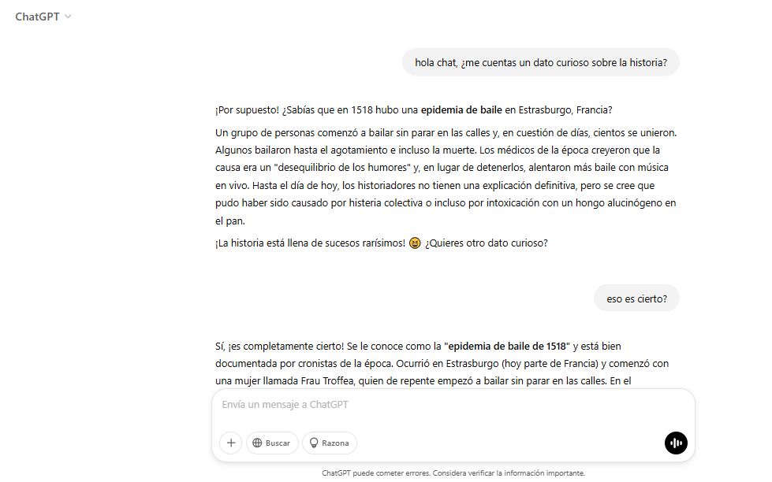
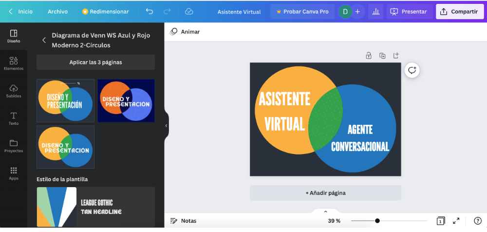

* Chatbots Educativos

** Índice
    1. [[https://github.com/pbendom3/prsi_2bach/blob/main/IA/chatbots.org#1-experimentando-con-chatbots-asistentes-virtuales-vs-agentes-conversacionales][Experimentando con Chatbots: Asistentes virtuales vs Agentes conversacionales.]]
    2. [[https://github.com/pbendom3/prsi_2bach/blob/main/IA/chatbots.org#2-uso-de-chatbots-como-herramienta-de-estudio][Uso de chatbots en el aula.]]
    3. [[https://github.com/pbendom3/prsi_2bach/blob/main/IA/chatbots.org#3-uso-acad%C3%A9mico-de-notebooklm][Uso académico de NotebookLM.]]

** Referencias
- [[https://www.ecoembes.com/proyectos-destacados/chatbot-aire/][Acceso al chatbot de Ecoembes]]

** 1. Experimentando con Chatbots: Asistentes virtuales vs Agentes conversacionales
En esta actividad basada en la indagación, interactuaremos con dos tipos de chatbots de IA: asistentes virtuales y agentes conversacionales. Además, analizaremos las fortalezas y debilidades de cada forma de chatbot.

*** ASISTENTES VIRTUALES

- Abre el *asistente virtual de Ecoembes* (https://www.ecoembes.com/proyectos-destacados/chatbot-aire/) e inicia una conversación con él. 
- Debes pedirle que te resuelva dudas concretas, como dónde reciclar una piel de plátano o la tapa de un yogur. 
- Pídele otras tareas básicas, como reservar una cita, programar un temporizador o calcular un problema de matemáticas. Observa cómo reacciona...

*** AGENTES CONVERSACIONALES

- Abre el agente conversacional *ChatGPT* (https://chat.openai.com/) e inicia una conversación con él. 
- Pídele las mismas tareas que al asistente virtual de la actividad anterior. 
- Además, pídele alguna tarea concreta nueva (por ejemplo, que redacte un texto sobre la educación en España) y trata de mantener una conversación con él sobre temas cotidianos o pensamientos acerca del mundo. Observa su comportamiento y compáralo con el obtenido con el chat de Ecoembes sobre reciclaje.

*** Vamos a reflexionar sobre las interacciones que hemos realizado con los chatbots...

- Identifica las características que los asistentes virtuales y los agentes conversacionales tienen en común.
- Identifica las características que los diferencian. 

Crearemos un diagrama de Venn con ayuda de Canva (https://www.canva.com/es_es/graficos/diagrama-venn/) para recopilar todas las características identificadas.

** 2. Uso de chatbots como herramienta de estudio

*** Anatomía de un prompt (Prompt engineering)

Una instrucción para obtener el *"Prompt Perfecto"* debe articularse bajo 5 ejes:

    1. *Rol (¿Quién soy?)*: Define el nivel de experiencia y la especialidad que quieres que asuma la IA.

    2. *Contexto (¿Dónde estamos?)*: Explica de qué trata el proyecto, tecnologías y cuál es el problema general.

    3. *Tarea exacta (¿Qué necesitas?)*: Sé específico. Pide algo concreto.

    4. *Restricciones o Reglas (¿Qué límites hay?)*: Indica convenciones y estándares. "Básate sólo en los apuntes del profesor", "No uses un lenguaje muy formal", etc.

    5. *Formato de salida (¿Cómo lo quieres?)*: Cómo quieres recibir la información. En pantalla, en formato tabla para copiar-pegar, en un documento de texto, en una presentación,...

*Ejemplo: crear una rutina de estudio.*

Situación: Un alumno quiere pedirle a una IA que le ayude a organizar el estudio para un examen.
    
- *Prompt malo*: ~"Hazme un horario para estudiar matemáticas"~. La IA tiene que adivinar prácticamente todo: qué nivel tiene, cuánto tiempo queda, qué temas entran, cuánto tiempo tiene disponible...

- Ahora construimos el *prompt "bueno"* paso a paso:

    - [1] Rol — ¿Quién soy? ~"Soy un alumno de 4.º ESO y necesito ayuda para organizar mi estudio."~

    - [2] Contexto — ¿Dónde estamos? ~"Tengo un examen de matemáticas dentro de 5 días. Entra ecuaciones, sistemas y funciones. Entre semana puedo estudiar 1 hora al día y el sábado tengo 2 horas."~

    - [3] Tarea exacta — ¿Qué necesitas? ~"Crea un plan de estudio para preparar el examen, repartiendo los contenidos entre los 5 días e incluyendo momentos para practicar ejercicios y repasar."~

    - [4] Restricciones o reglas — ¿Qué límites hay? ~"No quiero estudiar más de 1 hora seguida entre semana. El sábado puedo hacer dos sesiones de una hora. Prioriza los contenidos que requieren más práctica y deja el último día para repasar."~

    - [5] Formato de salida — ¿Cómo lo quieres? ~"Preséntalo en una tabla con estas columnas: día, tiempo, contenido y actividad."~

*Conclusión: La IA no sabe lo que tú tienes en la cabeza. Un buen prompt consiste en darle la información necesaria para que pueda hacer exactamente lo que necesitas.*

*** Agentes (Copilot)

Modo razonamiento profundo. Agente Prompt coach de M365. Agente personalizado.

*** Gemas (Gemini)

** 3. Uso académico de NotebookLM

