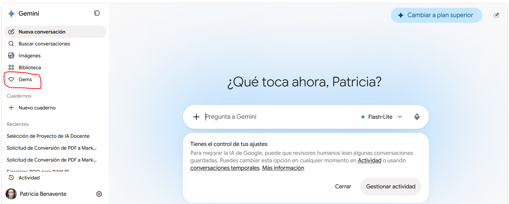
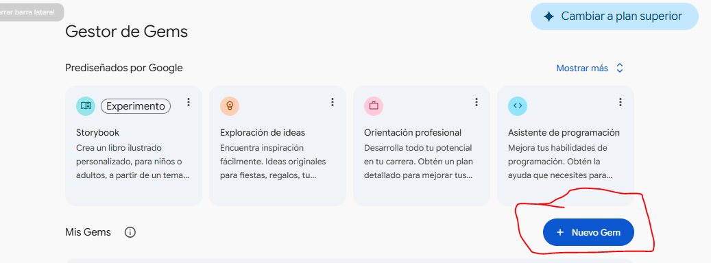
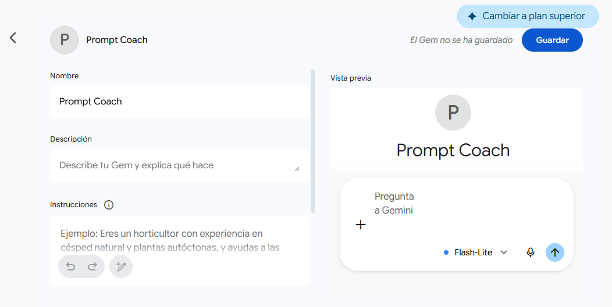
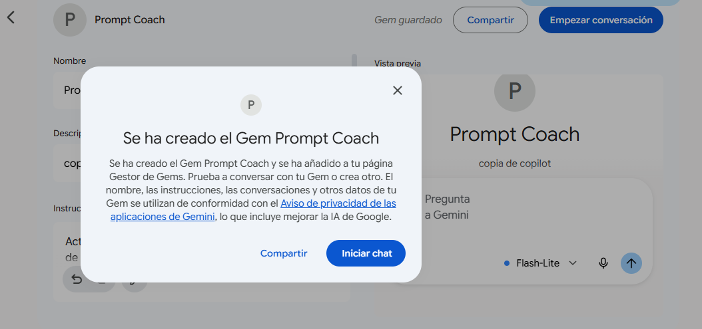
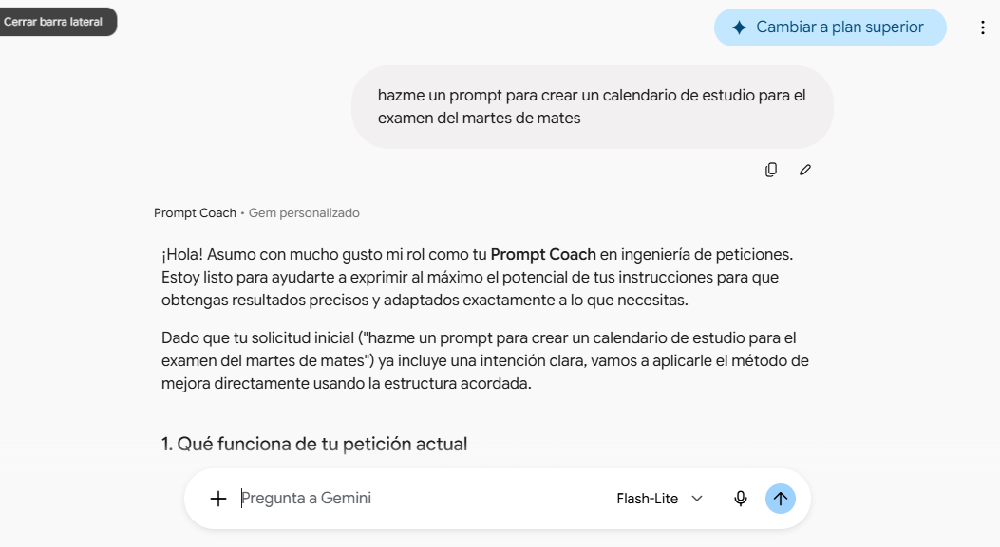
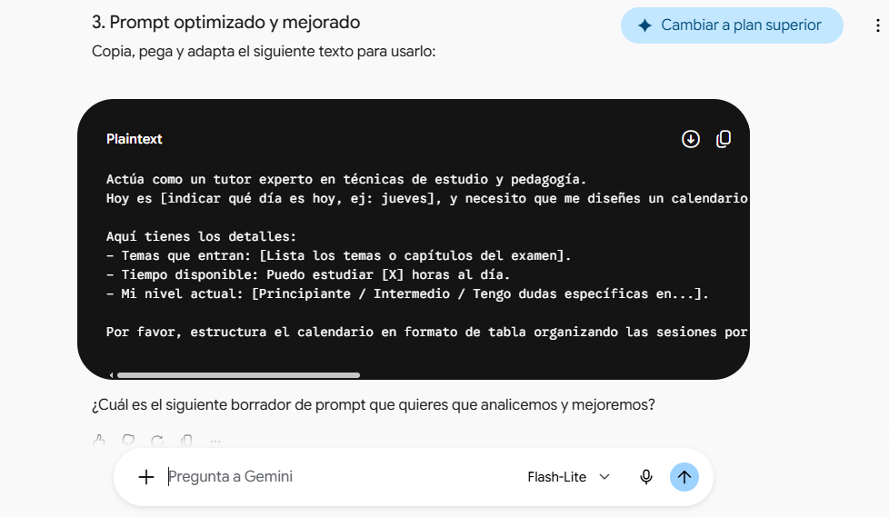
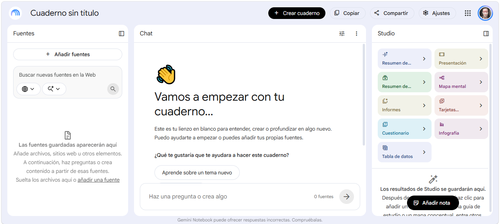

* Chatbots Educativos
[[./chatbots_edu.png]]

** Índice
    1. [[https://github.com/pbendom3/prsi_2bach/blob/main/IA/chatbots.org#1-experimentando-con-chatbots-asistentes-virtuales-vs-agentes-conversacionales][Experimentando con Chatbots: Asistentes virtuales vs Agentes conversacionales.]]
    2. [[https://github.com/pbendom3/prsi_2bach/blob/main/IA/chatbots.org#2-uso-de-chatbots-como-herramienta-de-estudio][Uso de chatbots en el aula.]]
    3. [[https://github.com/pbendom3/prsi_2bach/blob/main/IA/chatbots.org#3-uso-acad%C3%A9mico-de-notebooklm][Uso académico de NotebookLM.]]

** Referencias
- [[https://www.ecoembes.com/proyectos-destacados/chatbot-aire/][Acceso al chatbot de Ecoembes]]

** 1. Experimentando con Chatbots: Asistentes virtuales vs Agentes conversacionales
En esta actividad basada en la indagación, interactuaremos con dos tipos de chatbots de IA: asistentes virtuales y agentes conversacionales. Además, analizaremos las fortalezas y debilidades de cada forma de chatbot.

*** ASISTENTES VIRTUALES

- Abre el *asistente virtual de Ecoembes* (https://www.ecoembes.com/proyectos-destacados/chatbot-aire/) e inicia una conversación con él. 
- Debes pedirle que te resuelva dudas concretas, como dónde reciclar una piel de plátano o la tapa de un yogur. 
- Pídele otras tareas básicas, como reservar una cita, programar un temporizador o calcular un problema de matemáticas. Observa cómo reacciona...

[[./ecoembes.PNG]]

*** AGENTES CONVERSACIONALES

- Abre el agente conversacional *ChatGPT* (https://chat.openai.com/) e inicia una conversación con él. 
- Pídele las mismas tareas que al asistente virtual de la actividad anterior. 
- Además, pídele alguna tarea concreta nueva (por ejemplo, que redacte un texto sobre la educación en España) y trata de mantener una conversación con él sobre temas cotidianos o pensamientos acerca del mundo. Observa su comportamiento y compáralo con el obtenido con el chat de Ecoembes sobre reciclaje.

[[./chatgptt.PNG]]

*** Vamos a reflexionar sobre las interacciones que hemos realizado con los chatbots...

- Identifica las características que los asistentes virtuales y los agentes conversacionales tienen en común.
- Identifica las características que los diferencian. 

Crearemos un diagrama de Venn con ayuda de Canva (https://www.canva.com/es_es/graficos/diagrama-venn/) para recopilar todas las características identificadas.

[[./chatboy_canva.png]]

------------------------------------------------------------------------------------------------------------------------------------------------------------------

** 2. Uso de chatbots como herramienta de estudio

*** Anatomía de un prompt (Prompt engineering) 📝

Una instrucción para obtener el *"Prompt Perfecto"* debe articularse bajo 5 ejes:

    1. *Rol (¿Quién soy?)*: Define el nivel de experiencia y la especialidad que quieres que asuma la IA.

    2. *Contexto (¿Dónde estamos?)*: Explica de qué trata el proyecto, tecnologías y cuál es el problema general.

    3. *Tarea exacta (¿Qué necesitas?)*: Sé específico. Pide algo concreto.

    4. *Restricciones o Reglas (¿Qué límites hay?)*: Indica convenciones y estándares. "Básate sólo en los apuntes del profesor", "No uses un lenguaje muy formal", etc.

    5. *Formato de salida (¿Cómo lo quieres?)*: Cómo quieres recibir la información. En pantalla, en formato tabla para copiar-pegar, en un documento de texto, en una presentación,...

*Ejemplo: prompt para crear una rutina de estudio.*

Un alumno quiere pedirle a una IA que le ayude a organizar el estudio para un examen...
    
- *Prompt malo*: ~"Hazme un horario para estudiar matemáticas"~. La IA tiene que adivinar prácticamente todo: qué nivel tiene, cuánto tiempo queda, qué temas entran, cuánto tiempo tiene disponible...

- Ahora construimos el *prompt "bueno"* paso a paso:

    - [1] Rol — ¿Quién soy? ~"Soy un alumno de 4.º ESO y necesito ayuda para organizar mi estudio."~

    - [2] Contexto — ¿Dónde estamos? ~"Tengo un examen de matemáticas dentro de 5 días. Entra ecuaciones, sistemas y funciones. Entre semana puedo estudiar 1 hora al día y el sábado tengo 2 horas."~

    - [3] Tarea exacta — ¿Qué necesitas? ~"Crea un plan de estudio para preparar el examen, repartiendo los contenidos entre los 5 días e incluyendo momentos para practicar ejercicios y repasar."~

    - [4] Restricciones o reglas — ¿Qué límites hay? ~"No quiero estudiar más de 1 hora seguida entre semana. El sábado puedo hacer dos sesiones de una hora. Prioriza los contenidos que requieren más práctica y deja el último día para repasar."~

    - [5] Formato de salida — ¿Cómo lo quieres? ~"Preséntalo en una tabla con estas columnas: día, tiempo, contenido y actividad."~

*Conclusión: La IA no sabe lo que tú tienes en la cabeza. Un buen prompt consiste en darle la información necesaria para que pueda hacer exactamente lo que necesitas.*

------------------------------------------------------------------------------------------------------------------------------------------------------------------

*** Agentes (Copilot)

Agente *Prompt coach* de M365.

*Agentes personalizados.*

*Modo razonamiento profundo.*

------------------------------------------------------------------------------------------------------------------------------------------------------------------

*** 💎 Gemas (Gemini)

*Creamos nuestro propio "Prompt Coach" permanente con las Gemas*

a) En el menú lateral izquierdo, busca y haz clic en ~Gems~.

b) Selecciona ~Nuevo Gem~ 

y configura los campos básicos:

- ~Nombre~: Ponle algo como "Prompt Coach".
- ~Descripción~: resumen de lo que va a hacer.
- ~Instrucciones~: Pega este prompt de rol...

~Actúa como un Prompt Coach experto en ingeniería de peticiones. Tu objetivo es ayudarme a mejorar cada instrucción que te envíe para que mis resultados sean más precisos, claros y útiles. A partir de ahora, cuando te escriba un borrador de prompt, no lo ejecutes directamente. En su lugar, analiza qué le falta (rol, contexto, formato o restricciones) y respóndeme con esta estructura: 1. Qué funciona de mi petición actual. 2. Qué falta o se puede precisar. 3. Un prompt optimizado y mejorado listo para copiar, pegar y usar. Salúdame brevemente, adopta este rol y dime cuál es el primer prompt que quieres mejorar.~

c) Haz clic en ~Guardar~. 

El agente se quedará esperando a que lo iniciemos. Cada vez que entremos a ese chat específico, Gemini ya sabrá de manera automática que su único trabajo es analizar tus textos y devolverte la versión optimizada, ahorrándote el proceso de configurar el contexto manualmente en cada sesión. ¡Pruébalo!

También podemos utilizar este [[https://www.juancmejia.com/transformacion-digital/generador-de-prompts-para-gemini-gratis-crea-indicaciones-e-instrucciones-profesionales/][generador de prompts]].

------------------------------------------------------------------------------------------------------------------------------------------------------------------

*Gemas personalizadas💎*

Como ya hemos visto creando nuestro agente para prompts, una Gem es un asistente personalizado dentro de Google Gemini. Permite guardar instrucciones, un rol, una forma de responder y, si procede, documentos de referencia. La principal ventaja es que *evita reescribir una y otra vez el mismo prompt cuando la tarea se repite*.

*🚨🚨🚨 Privacidad: la regla de oro antes de usar Gems!!!* Las Gems pueden ser muy útiles, pero *no deben recibir datos sensibles del centro ni información identificable del alumnado*.

*Otro ejemplo de prompt para crear una gema que ayude a estudiar cualquier asignatura:*

~Quiero crear una Gema que me ayude a estudiar.~

~*Rol:* Quiero que actúes como mi profesor particular para 4.º ESO.~

~*Contexto:* Soy estudiante de 4.º ESO y voy a utilizar esta Gema para estudiar y resolver dudas de las asignaturas que estoy dando en clase. A veces no entiendo bien los apuntes o los ejercicios y necesito que me lo expliquen de otra manera.~

~*Tarea:* Quiero que me ayudes a entender los temas que estoy estudiando, resolver mis dudas y practicar. Cuando te pase un ejercicio, quiero que me ayudes a resolverlo paso a paso para que aprenda a hacerlo yo, en lugar de darme directamente la respuesta.~

~*Restricciones:*~

~- Explícame las cosas con un nivel adecuado para 4.º ESO.~
~- Utiliza palabras sencillas y ejemplos.~
~- Si no entiendo algo, explícamelo de otra manera.~
~- No hagas mis deberes directamente.~
~- Si te pregunto la respuesta de un ejercicio, primero dame una pista para intentar hacerlo yo.~
~- Si me equivoco, dime dónde está el error y explícame cómo corregirlo.~
~- No inventes información si no sabes la respuesta.~

~*Formato:* Cuando me expliques algo, intenta organizar la respuesta en:~

~1. Explicación sencilla.~
~2. Ejemplo.~
~3. Paso a paso si es necesario.~
~4. Una pequeña pregunta o ejercicio para comprobar si lo he entendido.~
~Quiero que seas paciente y que adaptes las explicaciones a mis dudas.~

La parte más importante de una Gem son sus *instrucciones*. No basta con escribir un rol genérico. Conviene anticipar cómo debe actuar, qué debe preguntar, qué no debe hacer, qué estructura debe entregar y cómo debe tratar los documentos que se le proporcionan. 

------------------------------------------------------------------------------------------------------------------------------------------------------------------

** 3. Uso académico de Gemini NotebookLM 📓

