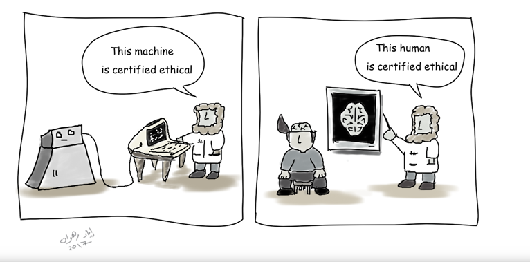
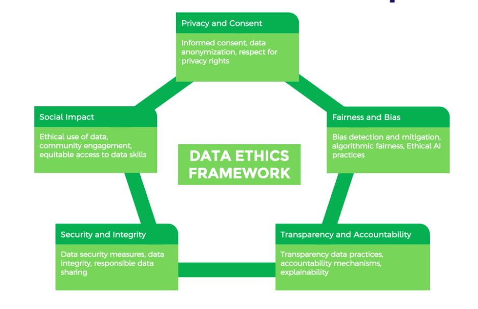
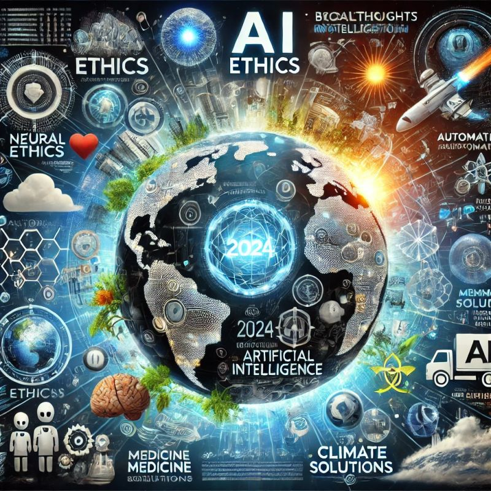
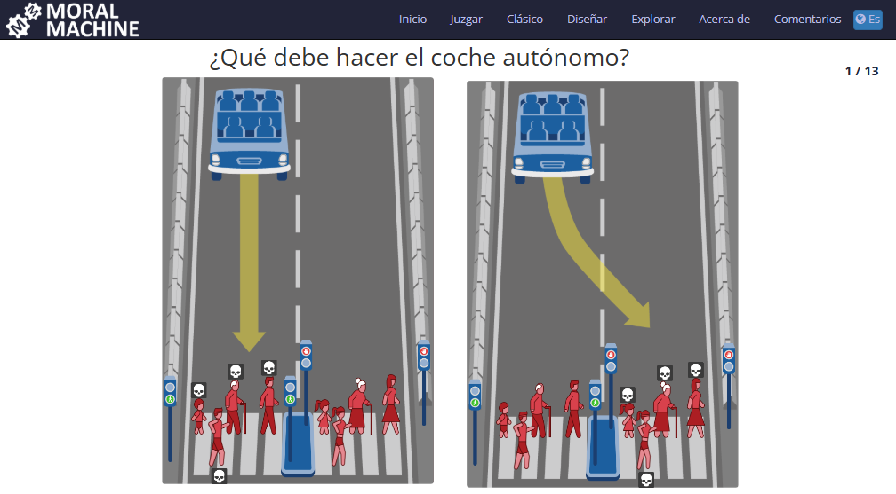

* Ética y sesgos en el uso de la IA.

** Índice
    1. [[https://github.com/pbendom3/seminario-IA/blob/main/sesion-2.org#1-implicaciones-%C3%A9ticas-y-sociales-de-los-sistemas-de-ia][Implicaciones éticas y sociales de los sistemas de IA.]]
    2. [[https://github.com/pbendom3/seminario-IA/blob/main/sesion-2.org#2-%C3%A9tica-en-el-aula][Ética en el aula.]]
    3. [[https://github.com/pbendom3/seminario-IA/blob/main/sesion-2.org#3-herramientas-asistidas-por-ia-que-se-utilizan-para-crear-y-distribuir-informaci%C3%B3n--tanto-informaci%C3%B3n-objetiva-como-desinformaci%C3%B3n-bulos-][Herramientas asistidas por IA que se utilizan para crear y distribuir información -tanto información objetiva como desinformación (bulos)-.]]
    4. [[https://github.com/pbendom3/seminario-IA/blob/main/sesion-2.org#4-introducci%C3%B3n-al-sesgo-con-moralmachine][Introducción al sesgo con moralmachine.]] 
    5. [[https://github.com/pbendom3/seminario-IA/blob/main/sesion-2.org#5-documental-sesgo-codificado-2020-netflix][Documental: Sesgo Codificado (2020, NETFLIX).]] 
   
** Referencias
- [[https://formacion.intef.es/aulaenabierto/mod/book/view.php?id=5073][INTEF - Ética en la inteligencia artificial]]
- [[https://www.youtube.com/watch?v=SPBn9gwgIsI&t=95s][Vídeo sobre Sora IA]] 
- [[https://www.moralmachine.net/hl/es][Acceso a Moral Machine]]
- [[https://www.netflix.com/es/title/81328723][Documental: Sesgo Codificado (2020, NETFLIX)]] 
- [[https://maldita.es/malditatecnologia/20241230/uso-2024-inteligencia-artificial-bulos-desinformar/][Cómo se ha usado en 2024 la inteligencia artificial para difundir bulos y desinformar]]
-  [[https://www.linkedin.com/pulse/cr%C3%ADticos-digitales-versus-vagos-d%C3%B3nde-te-posicionas-t%C3%BA-%C3%A0ngels-soriano-bo0tf/][“Críticos Digitales Versus Vagos digitales” ¿Dónde te posicionas Tú?]]
- [[https://unesdoc.unesco.org/ark:/48223/pf0000391105][Documento de La UNESCO sobre el Marco de referencia de las competencias en IA para los estudiantes]]
- [[https://artificialintelligenceact.eu/es/article/5/][UE, Prácticas prohibidas de IA]]

** 1. Implicaciones éticas y sociales de los sistemas de IA

Como culturilla general, cuando hablamos de la ética en las Inteligencias Artificiales no solamente debemos referirnos al modo en que utilizan los datos, si no también en la forma de obtenerlos y de guardarlos.

En general, los 3 ejes que se deben respetar siempre son:
    
    - Consentimiento y privacidad.
    - Seguridad y protección de los datos.
    - No discriminación.

La suma de estos conceptos implica garantizar que la información personal se recopile y maneje de manera que se protejan los derechos de las personas a la privacidad. Esto incluye obtener el consentimiento informado para la recopilación de datos o implementar medidas para proteger los datos personales. 

Además, se deben salvaguardar los datos contra el acceso no autorizado, las violaciones de seguridad y otras formas de uso indebido.

Por último, debemos garantizar que los datos se recopilen, procesen y utilicen de manera justa y no conduzca a ningún tipo de discriminación. Implica evitar sesgos en la recopilación y el análisis de datos, garantizar que los algoritmos y las decisiones basadas en datos no perpetúen la desigualdad y contribuir a lograr la inclusión.

~Además de esas 3 premisas, también debería cumplirse el principio de Transparencia: ¿Sabemos cómo se toman las decisiones algorítmicas? Debatimos con el caso de #Tiktok~

~Por otro lado, deberíamos tener cierta Responsabilidad: ¿Quién debe rendir cuentas cuando una IA comete un error? ¿Quién es el responsable final, nosotros los que escribimos los prompts o la IA que ejecuta el daño?~

🌟 La ética no es sólo un marco de referencia, sino una responsabilidad compartida entre quienes desarrollamos, implementamos y utilizamos la IA. 

🌟 *Meritxell Bretos: "La tecnología es una herramienta poderosa, pero su impacto dependerá siempre de las decisiones humanas detrás de ella".*

🌟 Y por último, un [[https://www.linkedin.com/posts/ramon-lopez-roldan-724b2686_ia-dalladbe-ethics-activity-7279767543030927361-zdjJ/?utm_source=share&utm_medium=member_ios][post de Ramon Lopez Roldan]] donde se sorprende de ver el protagonismo que le ha dado DALL-E a la palabra #ethics en el 2024, pidiéndole que le generara una imagen con el resumen de 2024 y la importancia que la IA ha tenido en él.

** 2. Ética en el aula

¿Si se detecta que un trabajo es copiado por parte de algún estudiante cómo os evalúan? ¿Lo habéis hablado en cuanto a vuestra Evaluación con los profes?

Protocolo de uso de IA:

- Cuándo se puede utilizar y qué datos no deben introducirse en una herramienta externa.
- Cómo debe declararse su uso (propiedad intelectual y atribución de contenido generado o transformado con IA). Evidencias que debe conservar el alumnado.
- Cómo se comprueba que el estudiante comprende lo entregado.

*Críticos Digitales vs Vagos digitales*

** 3. Kling AI, el motor de inteligencia artificial capaz de generar vídeo realista

[[https://kling.ai][KlingAI]] es el modelo de IA generativa de texto a vídeo. Esto significa que tú escribes un texto y él crea un vídeo que coincide con la descripción del texto. Aquí tienes unos ejemplos:

[[https://kling.ai/app]

*** Los riesgos de la generación de vídeo...

- *Generación de contenidos nocivos*

Sin barreras de protección, se pueden generar contenidos desagradables o inapropiados, como vídeos con violencia, gore, material sexual explícito, representaciones despectivas de grupos de personas y otras imágenes de odio, así como la promoción o glorificación de actividades ilegales.

Lo que constituye contenido inapropiado varía mucho en función del usuario (piensa en un niño que utiliza estas herramientas frente a un adulto) y del contexto de la generación del vídeo (un vídeo que advierte sobre los peligros de los fuegos artificiales podría convertirse fácilmente en sangriento de forma educativa).

- *Desinformación*

Según los vídeos de ejemplo que se pueden ver, uno de los puntos fuertes de estas IAs es su capacidad para crear escenas fantásticas que no podrían existir en la vida real. Esta fuerza también hace posible crear vídeos "deepfake" en los que personas o situaciones reales se transforman en algo que no es verdad. Cuando este contenido se presenta como verdad, ya sea accidentalmente (desinformación) o deliberadamente (desinformación), puede causar problemas.

Como escribió [[https://www.linkedin.com/pulse/navigating-ai-impact-elections-2024-digidiplomacy-icdhe/][Eske Montoya Martínez van Egerschot, Jefa de Gobernanza y Ética de la IA en DigiDiplomacy]], "la IA está remodelando las estrategias de campaña, la participación de los votantes y el propio tejido de la integridad electoral".

Los vídeos de IA convincentes pero falsos de políticos o adversarios de políticos tienen el poder de "difundir estratégicamente narrativas falsas y acosar a fuentes legítimas, con el objetivo de socavar la confianza en las instituciones públicas y fomentar la animadversión hacia diversas naciones y grupos de personas".

En un año con muchas elecciones importantes, desde Taiwán hasta la India y Estados Unidos, esto tiene amplias consecuencias.

- *Prejuicios y estereotipos*

Como ya hemos venido comentando durante las sesiones, el resultado de los modelos generativos de IA depende en gran medida de los datos con los que se han entrenado. Eso significa que los sesgos o estereotipos culturales en los datos de entrenamiento pueden provocar los mismos problemas en los vídeos resultantes. Como [[https://www.datacamp.com/es/podcast/fighting-for-algorithmic-justice-with-dr-joy-buolamwini-artist-in-chief-and-president-of-the-algorithmic-justice-league][Joy Buolamwini expuso en el episodio Luchando por la Justicia Algorítmica de DataFramed]], los sesgos en las imágenes pueden tener graves consecuencias en la actuación policial.

** 4. Herramientas asistidas por IA que se utilizan para crear y distribuir información -tanto información objetiva como desinformación (bulos)-

Durante los últimos años, la IA se ha usado para desinformar y crear confusión, polarizar en escenarios políticos y aumentar el caos en situaciones críticas como catástrofes naturales. Aquí tienes un resumen:

- Desmentimos constantemente imágenes generadas con IA que se han compartido como reales, como el papa Francisco de fiesta, la boxeadora Imane Khelif como un hombre, Katy Perry o Rihanna en la Met Gala y la torre Eiffel y el Museo del Louvre en llamas.

- Entre otras cosas que no sucedieron, se difundió una supuesta imagen del eclipse solar total de abril desde Panamá hecha con IA (el fenómeno no era visible desde el país) e imágenes falsas de un supuesto pulpo gigante en una playa.

- La IA generativa también se ha usado para desinformar durante situaciones de emergencia, como la DANA en España y los huracanes Milton y Helene en EEUU, y en sus elecciones presidenciales, con imágenes a favor y en contra de Trump y Harris. El propio Trump compartió en repetidas ocasiones imágenes hechas con IA que lo representan como un héroe en su red social (Truth Social) y en Twitter (ahora X). La imagen más viral fue la de un bebé en brazos de un bombero que supuestamente habría sido “rescatado con vida en Catarroja”, pero que [[https://maldita.es/malditobulo/20241104/foto-bebe-rescatado-catarroja-dana/][no era una imagen real]]. 

- Grok, la IA de Twitter, cuyo dueño Elon Musk ha usado para apoyar narrativas desinformadoras y cuya falta de restricciones da rienda suelta a la desinformación. Por el lado de Kamala Harris, no se detectó que ella o su equipo compartieran contenido generado con IA. Pero sí circularon imágenes creadas con IA de la candidata demócrata que la sexualizaban o caricaturizaban su ideología para desacreditarla. Algunas se usaron para sostener que Harris fueuna “prostituta de lujo” o una “escort”, o que tuvo una relación sentimental con Epstein. Elon Musk usó Grok para crear y difundir este tipo de imágenes de ella, como la que aparece vestida con un uniforme rojo con el símbolo comunista.

- Se usan imágenes generadas con IA en Facebook para obtener ingresos y chatbots de IA para crear de forma masiva artículos falsos o imprecisos en granjas de contenido. Además, la falta de contexto e información sobre la propia inteligencia artificial también puede implicar desinformación

*Pero ojo... Esto ya empieza a ser como el cuento de Pedro y el lobo*. También estamos llegando a un punto en el que sucede lo contrario: ahora que sabemos que se puede usar IA para crear contenidos hay imágenes que confunden a usuarios y nos hacen pensar que están hechas con IA, como la de los coches apilados en una calle tras la DANA, pero que sí son reales.

** 5. Introducción al sesgo con moralmachine

Dirígete al siguiente sitio web, donde vas a entrenar a un coche automático para tomar una serie de decisiones: https://www.moralmachine.net/

Es un «juego» en línea multilingüe que se planteó para recoger datos sobre cómo querrían los ciudadanos que los vehículos autónomos resolvieran dilemas morales en el contexto de accidentes inevitables, es decir, para evaluar las expectativas sociales sobre la manera en que los vehículos autónomos tendrían que resolver dilemas morales.

⚠️ *AVISO*: lamentablemente, algunas decisiones serán poco éticas...😥⚠️

Analizando las más de un millón de respuestas, se ve que hay diferencias culturales respecto a las preferencias para cada escenario. Algunas culturas prefieren salvar a los jóvenes; otras, a las mujeres, y otras, a las personas de alto estatus.

En cualquier caso, si el sistema del vehículo autónomo tiene acceso a información personal, cualquier decisión no aleatoria entre dos vidas siempre será discriminatoria. Si la decisión es aleatoria, tiene que considerar todas las posibilidades por igual y, por lo tanto, también tendrá que incluir al conductor del coche. Quizás este hecho no va muy a favor de las ventas de vehículos autónomos. Por otro lado, si las vidas de los conductores de coches autónomos se priorizan siempre por encima de las de los peatones, posiblemente la gente que «corra el riesgo» de ser peatón será la que no se pueda permitir tener un vehículo autónomo.

** 6. Documental: Sesgo Codificado (2020, NETFLIX)

[[https://www.netflix.com/es/title/81328723][Este documental]] investiga errores en los algoritmos después de que Joy Buolamwini, investigadora del MIT, revelara fallos en la tecnología de reconocimiento facial.

En concreto, Joy se da cuenta de que un programa de reconocimiento facial no distingue ni identifica su rostro como el de una persona cuantificable para su base de datos. Pero sí lo hace cuando se coloca una máscara neutra... y blanca.

Es el punto de partida de un documental que picotea en muchísimos temas, todos a partir de la arbitrariedad y falta de ética con la que los algoritmos recogen información para dar forma a sus bases de datos y los conocimientos con los que van engordando distintas IAs. Una arbitrariedad que toma forma a partir de prejuicios que todos tenemos y que hacen que, por ejemplo, y como dice uno de los participantes en este interesante documental, *el racismo se mecanice y se replique*.

*** ¿Cómo podemos protegernos contra el sesgo y la discriminación cuando los conjuntos de datos de formación pueden prestarse al sesgo?

Aunque las empresas suelen tener buenas intenciones en torno a sus esfuerzos de automatización, la incorporación de la IA en, por ejemplo, las prácticas de contratación, puede tener consecuencias imprevistas. En su esfuerzo por automatizar y simplificar un proceso, Amazon, "sin querer", sesgó por género a los posibles candidatos laborales [[https://incidentdatabase.ai/cite/37/][(enlace externo a ibm.com)]] para los puestos técnicos abiertos y, en última instancia, tuvo que descartar el proyecto.

A medida que las empresas son más conscientes de los riesgos de la IA, también se han vuelto más activas en este debate sobre la ética y los valores de la IA. Por ejemplo, el año pasado el CEO de IBM, Arvind Krishna, compartió que IBM ha puesto fin a sus productos de reconocimiento y análisis facial para uso general, haciendo hincapié en que "IBM se opone firmemente y no aprobará los usos de ninguna tecnología, incluida la tecnología de reconocimiento facial ofrecida por otros proveedores, para la vigilancia masiva, la elaboración de perfiles raciales, las violaciones de los derechos humanos y las libertades básicas, o cualquier propósito que no sea coherente con nuestros valores y Principios de Confianza y Transparencia".
